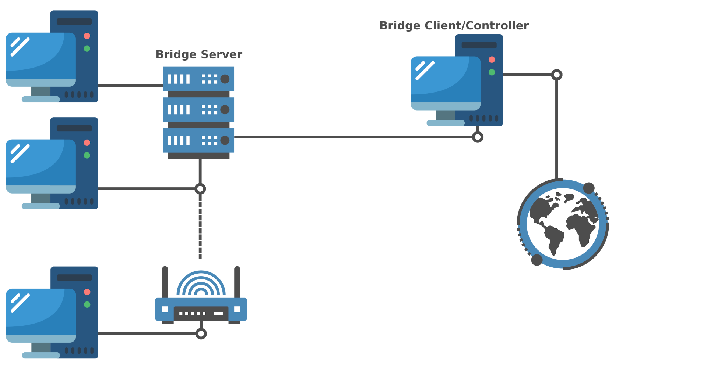

## What is this?
This project is a Python-based TCP tunneling system designed to address the challenges of P2P connections in environments where direct connections are disabled. It was created with the purpose of learning about sockets, multithreading, and selectors in Python while providing a practical solution for bridging connections between clients and servers.

### How does it work?
<p style="text-align: center">

</p>

#### How to start the bridge server
```python
from bridge import TCPTunnel
# Define the server's hostname and port
hostname = ("localhost", 5000)
# Initialize and start the server
TCPTunnel(hostname).server()
```

#### How to start the bridge client
```python
from bridge import TCPTunnel
# Define the server's hostname and port
hostname = ("localhost", 5000)
# Define the local port to be tunneled
local_port = 80
# The token must match the one assigned 
# by the bridge server.
token = 'secret-token123*'
# Initialize and start the client tunnel
TCPTunnel(hostname).tunnel(token, local_port)
```

Created with <3 by AngeloHH